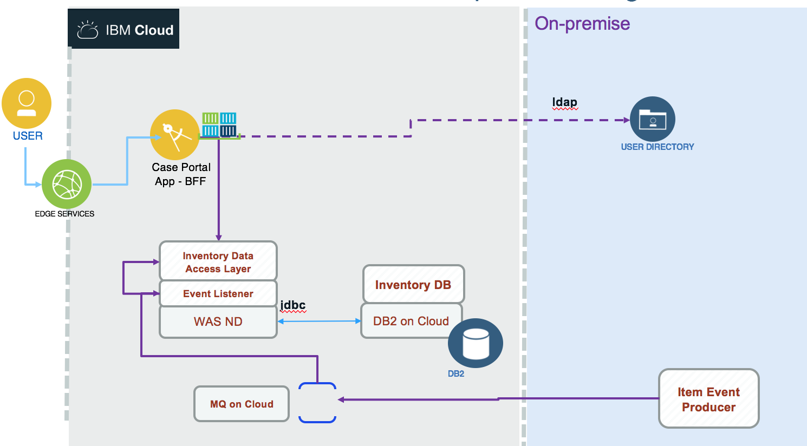

# MQ Messaging Solution
This project is part of the 'IBM Integration Reference Architecture' suite, available at [https://github.com/ibm-cloud-architecture/refarch-integration](https://github.com/ibm-cloud-architecture/refarch-integration).
It presents the implementation of an event producer to Queue managed by on-premise MQ queue manager or on IBM Cloud.

The Messaging application is integrated into the inventory management application. So the end state for the solution looks like in the figure below:

The event producer is a Java application using the MQ APIs to connect to a queue manager and send message as text. The payload is a json document representing a new item added to a warehouse. The MQ manager is defined with IBM Cloud and an Event Listener, implemented as Message Driven Bean deployed on traditional WebSphere Application Server. This code will use the inventory data access layer service to persist data into the Inventory Database on DB2.

Updated 08/16/2018

## Configuring MQ on Cloud service

### Create a MQ service
Once logged to the IBM Cloud console, using the `create new resource` button, select in the Catalog > Integration menu the `MQ` service:

In the next page enter a name, region and resource group:

Once the service is created it can be seen under the Services list of your dashboard:

### Create a MQ manager
When you opening the service you can create a queue manager by clicking on the `create` button:

and then selecting the size and a enter a name:

The queue manager is deploying, it can take some seconds...

Then it is up and running so we need to get the connection information by downloading a json document using the `Connection information` button:

### Get API key
To connect an application to a queue manager, it must have been granted permissions to access queue managers within your IBM MQ service instance. The application must connect to the queue manager using its MQ username and the password must be the application's API key.

So to create a API key do the following:

## Code

### Producer code
The producer's goal is to create "new item" events and send them to the queue. This is to simulate a warehouse backend service with mechanical systems which can scan item when reaching a specific part of the warehouse. The event will be processed to persist data in an Inventory database.
