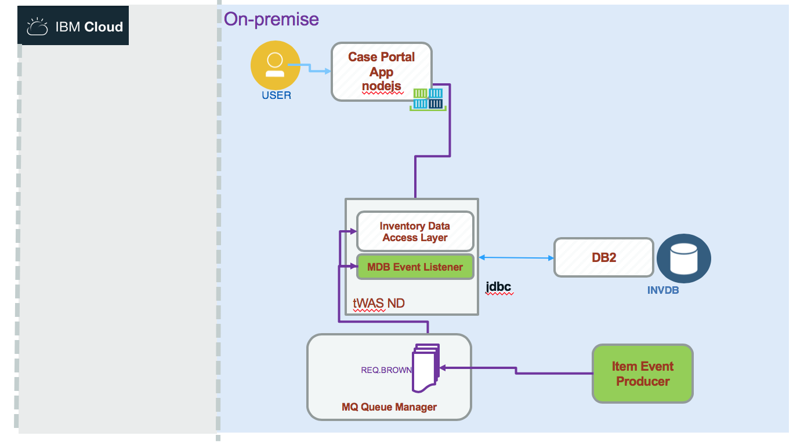
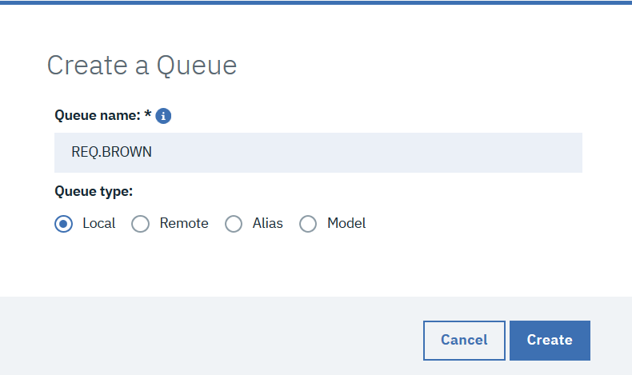
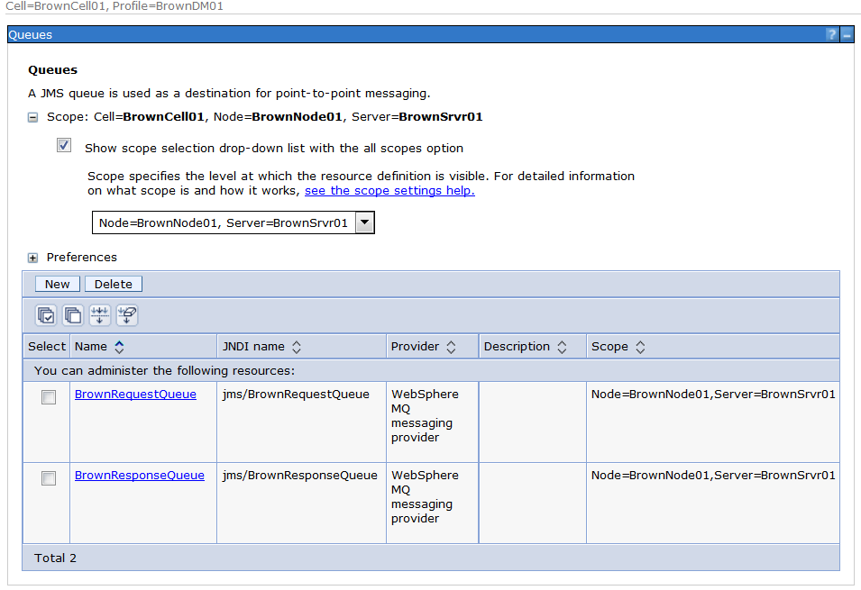
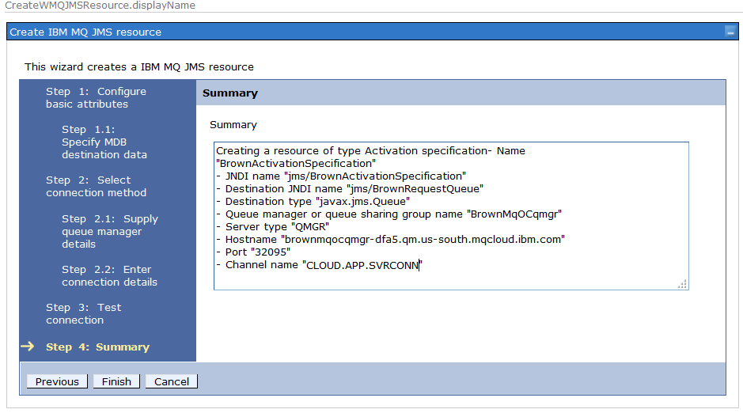

# MQ Messaging Solution
This project is part of the 'IBM Integration Reference Architecture' implementation solution, available at [https://github.com/ibm-cloud-architecture/refarch-integration](https://github.com/ibm-cloud-architecture/refarch-integration).

Updated 12/03/2018

It presents the implementation of an event producer, creating inventory update events, posted to a queue managed by IBM MQ Queue managed running on-premise servers or on IBM Cloud MQ service.

The Messaging application is integrated into the [inventory management](https://github.com/ibm-cloud-architecture/refarch-integration-inventory-dal) application / business use cases.

The event producer is a Java application using the MQ APIs to connect to a queue manager and send message as text. The payload is a json document representing a new item added to a warehouse. The MQ manager is defined with IBM Cloud and an Event Listener, implemented as Message Driven Bean deployed on traditional WebSphere Application Server. This code uses the inventory data access layer service to persist data into the Inventory Database on DB2.

## Table of contents

* [Getting started](#getting-started)
* [Environments](#environments)
    * [MQ running locally with docker](docker/README.md)
    * [MQ on premise with vSphere](#on-premise-mq-server-(vSphere))
    * [Configuring WebSphere Application Server to access MQ](#configuring-websphere-application-server-to-access-mq)
* [MQ on IBM Cloud](#configuring-mq-on-ibm-cloud-service)
* [Producer Code](#producer)
* [Consumer Code as MDB](#consumer)

## Getting Started

If you do know a minimum about MQ, here are a set of articles you may need to read to understand the content of this repository:
* [MQ Essentials- Getting started with IBM MQ](https://developer.ibm.com/messaging/learn-mq/mq-tutorials/getting-started-mq/) 
* [First demo on docker](https://developer.ibm.com/messaging/learn-mq/mq-tutorials/mq-connect-to-queue-manager/#docker)
* [MQ Cheat sheet](https://developer.ibm.com/messaging/learn-mq/mq-tutorials/dev-cheat-sheet/)
* [Develop a JMS point to point application](https://developer.ibm.com/messaging/learn-mq/mq-tutorials/develop-mq-jms/) The code of this IBM tutorial is also in this repository under the `democlient/MQJMSClient` folder so we can test the configuration.
* [IBM MQ v9.0+ product documentation](https://www.ibm.com/support/knowledgecenter/en/SSFKSJ_9.0.0/com.ibm.mq.helphome.v90.doc/WelcomePagev9r0.html)

### MQ Architecture background

An IBM MQ queue manager provides asynchronous intercommunication between the applications requesting the service and the applications providing the service.

* [Single Queue Manager](https://www.ibm.com/support/knowledgecenter/en/SSFKSJ_9.1.0/com.ibm.mq.pla.doc/q004710_.htm) Client applications can run locally to the MQ manager which manages MQ Objects like queues and channels. Applications can also access remotely the queue manager.  

* [Clustering](https://www.ibm.com/support/knowledgecenter/en/SSFKSJ_9.1.0/com.ibm.mq.pla.doc/q004691_.htm) Applications can gain asynchronous communication with a service hosted on another queue manager on another system, and queue manager can provide access to another queue manager. Routes that connect different queue managers and their queues are defined using distributed queuing techniques. The queue managers within the architecture are connected using channels.

### MQ lift and shift scenario

As illustrated in the figure below, a inventory / item event producer is sending message about inventory update in a warehouse, to a MQ server configured with queues and channels. An MDB listens to message and calls a SOAP service to persist the inventory update. The approach of the lift and shift scenario is to take this MDB and MQ instance and use the IBM MQ Service on IBM Cloud and deploy a the MDB on a WebSphere application server on IBM Cloud. The steps  can be summarized as:

* [Step 1- Run MQ solution locally](#1--environments) You can use docker or VM to run a MQ server locally on your computer or on a vSphere environment.
* [Step 2- Configure MQ service on IBM Cloud](#2--configuring-mq-on-ibm-cloud-service)

* [Step 3- Test with remote MQ]()
* [Step 4- Deploy the MDB on WAS service](#configuring-mdb-resources-on-websphere-application-server)

## 1- Environments

We propose two environments: `on-premise` and IBM Cloud. For the on-premise we propose two approaches: one with vSphere and one with docker so you can run the scenario on your laptop. See the [following note](docker/README.md) to configure and run the MQ docker image with the needed queues and channels used in the lift and shift scenario.

The following figure illustrates the starting "on-premise" environment running the five components of the lift and shift scenario.

The WebSphere application server has two applications deployed: one SOAP based web service for operations on the inventory entities and one message driven bean listening to messages on queue managed by MQ and calling the SOAP interface to persist inventory updates coming as message on the queue.

### MQ docker

We describe [in this note](docker/README.md) how to build and run your own image, or use our dockerhub public image (ibmcase/brownmq), built with the Queue, Channels, ... necessary for the lift and shift scenario. In this note we also describe how to run an inventory producer code and a consumer that help to test the environment and deployment.

### On premise MQ server (vSphere)

For on-premise server we are using a vSphere environment with at least three hosts, one running DB2 server, one WebSphere Application Server and one IBM MQ, we are describing this configuration [in this note](docs/mq-premise.md).

## IBM Cloud deployment

The event producer is still running on premise, so for tutorial purpose it runs as a Java program on your computer, but it is connected to a MQ manager running on IBM Cloud. The figure below illustrates the end state:

So first we need to configure MQ on IBM Cloud:

### 2- Configuring MQ on IBM Cloud service

#### Create a MQ service

Once logged to the IBM Cloud console, using the `create new resource` button, select in the Catalog > Integration menu the `MQ` service:

In the next page enter a name, region and resource group:

Once the service is created it can be seen under the Services list of your dashboard:

#### Create a MQ Queue Manager

When you opening the service you can create a queue manager by clicking on the `create` button:

and then selecting the size and a enter a name:

The queue manager is deploying, it can take some seconds...

Then it is up and running so we need to get the connection information by downloading a JSON document using the `Connection information` button.
Save the connection information file for a later step.

Next, let's setup a user account and an application account.
If you click the "back" arrow, you will see the list of Queue Managers. In this case it's only the one you created.

Click on the queue manager to manage it. Click on the "User permissions" and then the "Add User" button to add a user.

Now enter the email address for the user. Next click the "Generate MQ username". the MQ username is the username you need to use when connecting to the queue manager. Lastly, click the "Add permissions" button to create the user.

This screenshot shows the  newly created user with administrator privileges.

Now you have to create an application. Creating an application gives you a way to have MQ clients connect to your queue manager. Click on the "Application permissions" button. Next, click on the "Add application" button.

Enter an application name and click on the "Generate MQ username" button. 

Next, click on the "Add and generate API key" button.

You will see a dialog box where you can download your API key for your new application. The API key is your password when connecting to your queue manager.

Here is the resulting dialog after clicking the "Download" button.

This screenshot shows you the application that you just created.

You will have to retrieve your connection information for your queue manager. Click on the queue manager.

Click on the "Administration" tab.

Click on the "Connection information" button.

You will see a dialog to download your connection information. You can download the connection information in two formats (plain text or JSON). Here the "JSON text format" link is used.

Save your connection information.

Now, click the "Create IBM Cloud API key" button and you will see this dialog. Click the "Download" button.

Now you have to create queues on your queue manager. Click the "Launch MQ Console" button and the MQ Console will open in another browser tab. Enter your administrator username and API key (which is the password).

Create a request queue.

Create a response queue.

### 3- Testing Remote MQ manager 

### 4- Configuring MDB resources on WebSphere Application Server

We assume you have an existing WebSphere service up and running. Log into the WebSphere Admin Console.

Navigate to: Resources->JMS->Queue connection factories

#### Create Queue Connection Factory

Select the scope and click the "New" button.

Select "WebSphere MQ messaging provider" and click the "OK" button.

Enter the "Name" and "JNDI name" and click the "Next" button.

Select the "Enter all the required information into this wizard" button and click "Next".

Enter the queue manager name and click the "Next" button.

Enter the hostname, port and server connection channel and click "Next".

Click the "Next" button (Test won't work).

Preview your selections and click the "Finish" button.

Save your configuration changes.

#### Create Request Queue

Navigate to: Resources->JMS->Queues

Select the scope and click the "New" button.

Select WebSphere MQ messaging provider and click "OK".

Fill in the Name, JNDI name and Queue name fields and click "OK".

Save your configuration changes.

#### Create Response Queue

Navigate to: Resources->JMS->Queues

Select the scope and click the "New" button.

Select WebSphere MQ messaging provider and click "OK".

Fill in the Name, JNDI name and Queue name fields and click "OK".

Save your configuration changes.

Here are the two queues you just created.

#### Create Activation Specification

Navigate to: Resources->JMS->Activation specifications

Click the "New" button.

Select WebSphere MQ messaging provider and click "OK".

Enter the Name and JNDI name and click "Next".

Enter the destination JNDI name (which is the request queue) and click "Next".

Select the "Enter all the required information into this wizard" button and click "Next".

Enter the queue manager name and click "Next".

Enter the hostname, port and server connection channel and click "Next".

Click the "Next" button (Test won't work).

Review your selections and click "Finish".

Save your configuration changes.

#### Create JAAS Authentication Alias

Go back to the main page for the Activation Specification which you just completed and click the "JAAS - J2C authentication data" link.

Click the "New" button.

Enter the alias, user ID and password. The user ID will be your application name and the password will be the API key matched the the application name. Click the "OK" button.

Save you configuration changes.

#### Create-Deploy-EAR

Navigate to: Applications->New Application

Upload the EAR file and click "Next".

Select the "Detailed" path and click "Next".

Check the "Deploy enterprise beans" and click "Next".

Map the EJB and click "Next".

Click "Next".

Click "Next".

Click "Next".

Make sure your Activation specification parameters match the resources you created. Click "Next".

Make sure your response queue parameter matches the resource you created. Click "Next".

Make sure your connection queue factory parameter matches the resource you created. Click "Next".

Click "Continue".

Click "Next".

Click "Next".

Review your selections and click "Finish".

Make sure the EAR deploys and then Save your configuration.

After you deploy the EAR, you have another step to do. You have to set your Authentication Alias on the application's connection factory.

In the WAS Admin Console, navigate to Applications->All applications and click on your application. Once your application details page (not shown) opens, click on the "Resource references" link (lower left).

Select the EJB, and click on the "Modify Resource Authentication Method" button. Now you will see this dialog.

Check the "user default method" radio button and use the pull-down list to select your authentication alias. Lastly, click the "Apply" button.

The "Authentication data entry" should be set to your authentication alias (and not "None"). Lastly, click on the "OK" button (not shown here).

On this page, accept the warning and click the "Continue" button.

#### Final Configuration Steps

First, you need to add this JVM command line parameter:

-Dcom.ibm.mq.cfg.jmqi.useMQCSPauthentication=true

Navigate to "All servers" and click on your server. 
Then, expand "Java and Process Management" and click on "Process definition". Then, click on the "Java Virtual Machine" link.
Finally, add the JVM command line parameter to the text box labeled "Generic JVM arguments".

NOTE #1: Queue Permissions

The cloud-based queue manager will create default queues (DEV.QUEUE.1, DEV.QUEUE.2, DEV.QUEUE.3). They will have the correct permissions for the application user names and passwords that you configure. If you use them, you don't have to do anything more.

But, if you create your own queues, you have to modify the permissions for your queues. The following link (see line 48) shows the runmqsc commands that configure the default rules to allow access to the "DEV.*" queues, so you would need to execute an equivalent command to grant permission to your own queues:

https://github.com/ibm-messaging/mq-container/blob/4d4051312eb9d95a086e2ead76482d1f1616d149/incubating/mqadvanced-server-dev/10-dev.mqsc.tpl#L48

NOTE #2: TLS between WAS and MQ

If you want to encrypt the communication between WAS and MQ, here is a scenario that secures a WAS to MQ application using TLS. You can leverage this next link and adapt it to your environment:

https://www.ibm.com/support/knowledgecenter/prodconn_1.0.0/com.ibm.scenarios.wmqwassecure.doc/topics/cfgssl_was.htm?cp=SSFKSJ_9.0.0

NOTE #3: When connecting to the queue manager, the WebSphere application must pass its username and password (API key) to the cloud based queue manager. There is an issue with the fact that the length of the API key is too long. To address this, you have to use the MQCSP authentication mode.

WAS v8.5.5 includes an old version of the MQ resource adapter (from MQ v7.1, see https://www-01.ibm.com/support/docview.wss?uid=swg21248089) which doesn't have the capability to control the compatibility mode, so we are basically sure that only a subset of the password is being sent, and so causing the problem you are seeing.

There isn't an option to update the MQ resource adapter inside WAS v8.5.5 so the path we would recommend is to use WAS v9.0 as the target server version. 

WAS 9.0 includes a more up to date MQ resource adapter version against which you can then set a generic JVM argument 
"-Dcom.ibm.mq.cfg.jmqi.useMQCSPauthentication=true" in order to ensure the full password is transmitted as detailed here https://www.ibm.com/support/knowledgecenter/en/SSFKSJ_9.0.0/com.ibm.mq.sec.doc/q118680_.html (note that this applies to all MQ applications running in that appserver JVM)

## Code

### Producer

The producer's goal is to create "new item" events and send them to the queue. This is to simulate a warehouse backend service with mechanical systems which can scan item when reaching a specific part of the warehouse. The event will be processed to persist data in an Inventory database.

### Consumer

BrownEAR is a JEE application that contains one MDB (message
driven bean) EJB that reads a message from a request queue and then writes the
same message (with “Hello” as a prefix) to a response queue.

