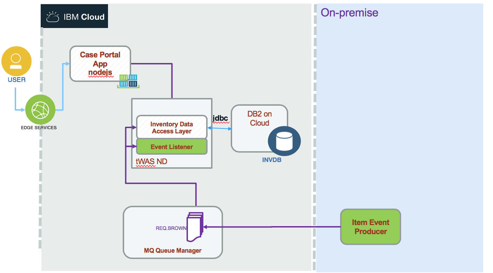

# MQ Messaging Solution
This project is part of the 'IBM Integration Reference Architecture' suite, available at [https://github.com/ibm-cloud-architecture/refarch-integration](https://github.com/ibm-cloud-architecture/refarch-integration).

Updated 09/19/2018

It presents the implementation of an event producer, creating inventory update event, posted to a queue managed by IBM MQ Queue managed running on-premise or on IBM Cloud.

The Messaging application is integrated into the [inventory management](https://github.com/ibm-cloud-architecture/refarch-integration-inventory-dal) application.

The event producer is a Java application using the MQ APIs to connect to a queue manager and send message as text. The payload is a json document representing a new item added to a warehouse. The MQ manager is defined with IBM Cloud and an Event Listener, implemented as Message Driven Bean deployed on traditional WebSphere Application Server. This code will use the inventory data access layer service to persist data into the Inventory Database on DB2.

## Table of contents
* [Environments](#environments)
* [MQ on IBM Cloud](#configuring-mq-on-ibm-cloud-service)
* [Producer Code](#producer)
* [Consumer Code as MDB](#consumer)

## Environments
We have two environments: on-premise and IBM Cloud.

### On premise MQ server


#### Configuration Queue manager
Start MQ Explorer from your server installation


Under the Queue Managers folder look at the standard QM definition.

#### Queues
This is a standard QM definition.


Under `Channels`, one server connection channel (CLOUD.APP.SVRCONN) was defined for the MDB to exclusively use to connect to the queue manager.


For the CLOUD.APP.SVRCONN channel, the MCA user ID was set
to `admin`. This means that the MDB application will be connected to the Queue Manager as “admin” which is a user ID defined on the operating system where the Queue Manager is running.


#### Channel Authentication Record
One channel authentication record was added to the CLOUD.APP.SVRCONN to not block users.


#### Listener
One listener was defined with port 1415 for the MDB application to connect into


#### Runmqsc Commands
These commands were issued with the “runmqsc” CLI to allow clients
to connect.

```
SET CHLAUTH(CLOUD.APP.SVRCONN) TYPE(BLOCKUSER) USERLIST('nobody')`

ALTER AUTHINFO(SYSTEM.DEFAULT.AUTHINFO.IDPWOS) AUTHTYPE(IDPWOS) CHCKCLNT(OPTIONAL)

REFRESH SECURITY TYPE(CONNAUTH)
```

### Configuring WebSphere Application Server to access MQ
As the MDB will be deployed as EJB on WebSphere Application Server, we need to do some configuration:

#### Define Queue Connection Factory


#### Defining Queues


#### Defining activation specification


#### Authentication Alias


### IBM Cloud deployment




#### Configuring MQ on IBM Cloud service

##### Create a MQ service
Once logged to the IBM Cloud console, using the `create new resource` button, select in the Catalog > Integration menu the `MQ` service:


In the next page enter a name, region and resource group:


Once the service is created it can be seen under the Services list of your dashboard:


##### Create a MQ Queue Manager
When you opening the service you can create a queue manager by clicking on the `create` button:


and then selecting the size and a enter a name:


The queue manager is deploying, it can take some seconds...


Then it is up and running so we need to get the connection information by downloading a JSON document using the `Connection information` button.
Save the connection information file for a later step.

Next, let's setup a user account and an application account.
If you click the "back' arrow, you will see the list of Queue Managers. In this case it's only the one you created.


##### Get API key
To connect an application to a queue manager, it must have been granted permissions to access queue managers within your IBM MQ service instance. The application must connect to the queue manager using its MQ username and the password must be the application's API key.

So to create a API key do the following:


## Code

### Producer
The producer's goal is to create "new item" events and send them to the queue. This is to simulate a warehouse backend service with mechanical systems which can scan item when reaching a specific part of the warehouse. The event will be processed to persist data in an Inventory database.

### Consumer
BrownEAR is a JEE application that contains one MDB (message
driven bean) EJB that reads a message from a request queue and then writes the
same message (with “Hello” as a prefix) to a response queue.

### EAR deployment
When you deploy the EAR, make sure the activation specification parameters are correct and match your artifact names.


