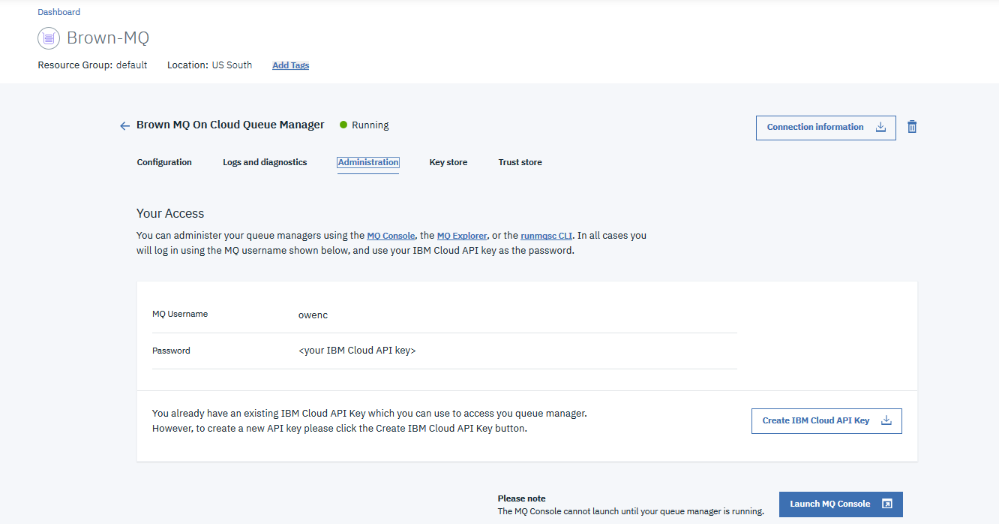
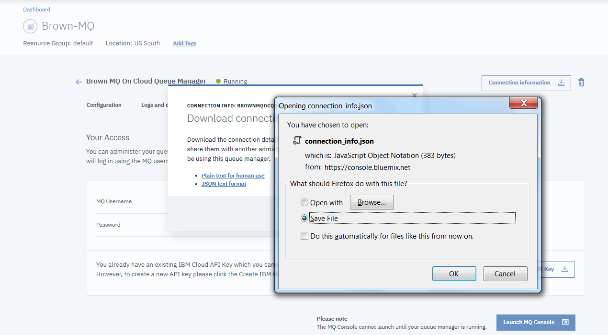

# MQ Messaging Solution
This project is part of the 'IBM Integration Reference Architecture' implementation solution, available at [https://github.com/ibm-cloud-architecture/refarch-integration](https://github.com/ibm-cloud-architecture/refarch-integration).

Updated 12/03/2018

It presents the implementation of an event producer, creating inventory update events, posted to a queue managed by IBM MQ Queue managed running on-premise servers or on IBM Cloud MQ service.

The Messaging application is integrated into the [inventory management](https://github.com/ibm-cloud-architecture/refarch-integration-inventory-dal) application / business use cases.

The event producer is a Java application using the MQ APIs to connect to a queue manager and send message as text. The payload is a json document representing a new item added to a warehouse. The MQ manager is defined with IBM Cloud and an Event Listener, implemented as Message Driven Bean deployed on traditional WebSphere Application Server. This code uses the inventory data access layer service to persist data into the Inventory Database on DB2.

## Table of contents

* [Getting started](#getting-started)
* [MQ lift and shift scenario](#mq-lift-and-shift-scenario)
* [Environments](#1--environments)
    * [MQ running locally with docker](docker/README.md)
    * [MQ on premise with vSphere](#on-premise-mq-server-(vSphere))
    * [Configuring WebSphere Application Server to access MQ](#4--configuring-websphere-application-server-to-access-mq)
* [MQ on IBM Cloud](#2--configuring-mq-on-ibm-cloud-service)
* [Producer Code](producer/README.md)
* [Consumer Code as MDB](mdb-consumer/README.md)

## Getting Started

If you do know a minimum about MQ, here are a set of articles you may need to read to understand the content of this repository:
* [MQ Essentials- Getting started with IBM MQ](https://developer.ibm.com/messaging/learn-mq/mq-tutorials/getting-started-mq/) 
* [First demo on docker](https://developer.ibm.com/messaging/learn-mq/mq-tutorials/mq-connect-to-queue-manager/#docker)
* [MQ Cheat sheet](https://developer.ibm.com/messaging/learn-mq/mq-tutorials/dev-cheat-sheet/)
* [Develop a JMS point to point application](https://developer.ibm.com/messaging/learn-mq/mq-tutorials/develop-mq-jms/) The code of this IBM tutorial is also in this repository under the `democlient/MQJMSClient` folder so we can test the configuration.
* [IBM MQ v9.0+ product documentation](https://www.ibm.com/support/knowledgecenter/en/SSFKSJ_9.0.0/com.ibm.mq.helphome.v90.doc/WelcomePagev9r0.html)

You can use our docker image to run a local MQ, see instructions in [this section](docker/README.md).

### MQ Architecture background

An IBM MQ queue manager provides asynchronous intercommunication between the applications requesting the service and the applications providing the service.

In th above figure we group the following concepts:
* [Single Queue Manager](https://www.ibm.com/support/knowledgecenter/en/SSFKSJ_9.1.0/com.ibm.mq.pla.doc/q004710_.htm) Client applications can run locally to the MQ manager which manages MQ Objects like queues and channels. Applications can also access remotely the queue manager.  

* [Clustering:](https://www.ibm.com/support/knowledgecenter/en/SSFKSJ_9.1.0/com.ibm.mq.pla.doc/q004691_.htm) Applications can gain asynchronous communication with a service hosted on another queue manager on another system, and queue manager can provide access to another queue manager. Routes that connect different queue managers and their queues are defined using distributed queuing techniques. The queue managers within the architecture are connected using channels.

## MQ lift and shift scenario

As illustrated in the figure below, the inventory / item event producer is sending messages about inventory update occuring in a warehouse, to a MQ manager configured with queues and channels. A MDB listens to messages and calls a SOAP service to persist the inventory update. The approach of the lift and shift scenario is to take this MDB and MQ instance and use the IBM Cloud MQ Service and deploy the MDB on a WebSphere application server on IBM Cloud. The steps can be summarized as below:

* [Step 1- Run MQ solution locally](#1--environments) You can use docker or VM.
* [Step 2- Configure MQ service on IBM Cloud](#2--configuring-mq-on-ibm-cloud-service)
* [Step 3- Test with remote MQ](producer/README.md#test-with-mq-on-ibm-cloud)
* [Step 4- Deploy the MDB on WAS service](#configuring-mdb-resources-on-websphere-application-server)

## 1- Environments

We propose two environments: `on-premise` and IBM Cloud. For the on-premise we propose two approaches: one with vSphere and one with docker so you can run the scenario on your laptop. See the [following note](docker/README.md) to configure and run the MQ docker image with the needed queues and channels used in the lift and shift scenario.

The following figure illustrates the starting "on-premise" environment running the five components of the lift and shift scenario.

The WebSphere application server has two applications deployed: one SOAP based web service for operations on the inventory entities and one message driven bean listening to messages on queue managed by MQ and calling the SOAP interface to persist inventory updates coming as message on the queue.

### MQ docker

We describe [in this note](docker/README.md) how to build and run your own image, or use our dockerhub public image (ibmcase/brownmq), built with the Queue, Channels, ... necessary for the lift and shift scenario. In this note we also describe how to run an inventory producer code and a consumer that help to test the environment and deployment.

### On premise MQ server (vSphere)

For on-premise server we are using a vSphere environment with at least three hosts, one running DB2 server, one WebSphere Application Server and one IBM MQ, we are describing this configuration [in this note](docs/mq-premise.md).

## IBM Cloud deployment

The event producer is still running on premise, so for tutorial purpose it runs as a Java program on your computer, but it is connected to a MQ manager running on IBM Cloud. The figure below illustrates the end state:

So first we need to configure MQ on IBM Cloud:

### 2- Configuring MQ on IBM Cloud service

#### Create a MQ service

Once logged to the IBM Cloud console, using the `create new resource` button, select in the Catalog > Integration menu the `MQ` service:

In the next page enter a name, region and resource group:

Once the service is created it can be seen under the Services list of your dashboard:

#### Create a MQ Queue Manager

When you opening the service, you can create a queue manager by clicking on the `create` button:

and then selecting the size for the deployment environment and entering a name: (BrownMqOCqmgr)

The queue manager will take some time to deploy...

When it is up and running, you need to get the connection information by downloading a JSON document using the `Connection information` button and selecting JSON text format. Save the connection information file for a later step.

#### Adding user account for channel connection

Next, let's setup a user account and an application account.
If you click the "back" arrow, you will see the list of Queue Managers. In this case it's only the one you created.

Click on the queue manager to manage it. Click on the "User permissions" and then the "Add User" button to add a user.

Now enter the email address for the user. Next click the "Generate MQ username". the MQ username is the username you need to use when connecting to the queue manager. Lastly, click the "Add permissions" button to create the user.

This screenshot shows the  newly created user with administrator privileges.

#### Adding application permissions

Now you have to create an application. Creating an application gives you a way to have MQ clients connect to your queue manager. Click on the "Application permissions" button. Next, click on the "Add application" button.

Enter an application name and click on the "Generate MQ username" button. 

Next, click on the "Add and generate API key" button.

You will see a dialog box where you can download your API key for your new application. The API key is your password when connecting to your queue manager.

Here is the resulting dialog after clicking the "Download" button.

This screenshot shows you the application that you just created.

#### Getting connection information

You will have to retrieve your connection information for your queue manager. Click on the queue manager.

Click on the "Administration" tab.

Click on the "Connection information" button.

You will see a dialog to download your connection information. You can download the connection information in two formats (plain text or JSON). Here the "JSON text format" link is used.

Save your connection information.

Now, click the "Create IBM Cloud API key" button and you will see this dialog. Click the "Download" button.

#### Work with MQ Console 

Now you have to create queues on your queue manager. Click the "Launch MQ Console" button and the MQ Console will open in another browser tab. Enter your administrator username and API key (which is the password).

Create the REQ.BROWN request queue.

Create the RESP.BROWN response queue.

Now you should see the following information in the MQ console:

### 3- Testing Remote MQ manager

Once the MQ on IBM Cloud queue manager is up and running and queues are defined you can use the Inventory producer to post message to the MQ queue and even test the end to end messaging with a consumer. The description of this code and how to run it is described in [this note](producer/README.md)

### 4- Configuring MDB resources on WebSphere Application Server

We assume you have an existing WebSphere service up and running. Log into the WebSphere Admin Console and follow the instructions in [this note](docs/mdb-twas/README.md).

## Contributing

As this implementation solution is part of the Event Driven architeture reference architecture, the [contribution policies](./CONTRIBUTING.md) apply the same way here.
