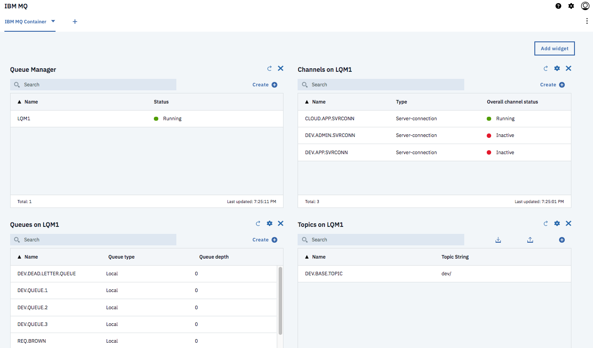

# Running MQ within Docker

The goal of this article is to present how to run IBM MQ docker container with your own configuration. We started our lift and shift implementation on vSphere. But to make the scenario lighter we move the configuration to an external file and use it to define a new docker image.

## Run

To start the quickest way we have developed the script [runmqdocker.sh](./runmqdocker.sh) to start MQ as daemon.
This script uses our dockerhub published public image: [ibmcase/brownmq](https://cloud.docker.com/u/ibmcase/repository/docker/ibmcase/brownmq). Just running this image will give you the necessary MQ deployment.

> __Attention__: Queue manager and queue data are saved in the filesystem. To avoid losing the queue manager and queue data we use volumes. Volumes are attached to containers when they are run and persist after the container is deleted. The following command creates a volume
 ```shell
 docker volume create qm1data
 ```

The remote MQ clients use a `Channel` to communicate with the MQ manager and over the network. We need to create a network to support this communication
```
docker network create mq-brown-network
``` 

Yo validate the installation, we need to connect to the server via the command: `docker exec -ti localMQ /bin/bash`. Once logged we can verify the installation and data paths by running `dspmqver` command:

```shell
(mq:9.1.0.0)root@38c35b86d5a5:/# dspmqver
Name:        IBM MQ
Version:     9.1.0.0
Level:       p910-L180709.DE
BuildType:   IKAP - (Production)
Platform:    IBM MQ for Linux (x86-64 platform)
Mode:        64-bit
O/S:         Linux 4.9.125-linuxkit
InstName:    Installation1
InstDesc:    
Primary:     Yes
InstPath:    /opt/mqm
DataPath:    /var/mqm
MaxCmdLevel: 910
LicenseType: Developer
```

Display your running queue managers:

```
(mq:9.1.0.0)root@38c35b86d5a5:/# dspmq
QMNAME(LQM1)                                              STATUS(Running)
```
Perfect we can test our inventory consumer and producer now, see [this section](#test-inventory-jms-consumer-/-producer) for explanations. But if you want to build the docker image yourself see [next section](#build-a-docker-image).

## Build a docker image

We are reusing the official IBM mq docker image for developers (`ibmcom/mq`). The image runs an ubuntu image. The queue manager listener listens on port 1414 for incoming connections and port 9443 is used by MQ console.
Inside the container, the default MQ installation on Ubuntu has the following objects and permissions set:
 > Queue manager QM1  
  Queue DEV.QUEUE.1  
  Channel DEV.APP.SVRCONN  
  Listener DEV.LISTENER.TCP on port 1414

To match our legacy settings used during the "lift and shift" scenario implementation, we have developed a MQ config file [brown-config.mqsc](./brown-config.mqsc) and used it to configure the MQ docker container. You can build this image from our dockerfile if you want to modify this configuration for your own purpose. The command `build.sh` can be used to build your own image and the script `runmqdocker.sh` to start a localMQ.


The script `runmqdocker.sh` starts MQ as daemon. 

### MQ Console 

The MQ Console is accessible at https://localhost:9443/ibmmq/console/login.html with default user admin / passw0rd. Here is an example of console layout with Queue manager (LQM1), channels (CLOUD.APP.SRVCONN) and queues (REQ.BROWN):



## Test Inventory JMS Consumer / Producer

We propose two implementations for the item producer: One implementation using the JMS API and one using the MQ Java api. To run the JMS producer and consumer do the following steps:

1. Start a terminal window (bash or shell)
1. cd `producer` folder
1. Start the JMS consumer that is listening to message arriving on REQ.BROWN queue and parses it as an Inventory:  `./runJmsMQConsumer.sh`.
1. In a second terminal window, under the `producer` folder, start the producer code that will parse an inventory definition defined in the `data/item1.json` and sends it to the REQ.BROWN queue. 

The trace within the Producer terminal should look like:
> #####################################  
 Produce item inventory message to MQ  
Platform:IBM MQ on Premise  
Queue Manager:LQM1  
Queue Name:REQ.BROWN  
channel:CLOUD.APP.SVRCONN   
hostname:localhost   
port:1414   
userid:admin   
password:passw0rd   
SUCCESS  

And on the consumer terminal the trace is:
> ########################################  
 Consumer for inventory message from MQ   
 Queue: REQ.BROWN  
 ########################################  
  Waiting....  
  Received message:
 {"itemId":12,"quantity":10,"site":"Manif01","supplierId":5,"cost":12.0}  
 Inventory:
 item= 12 for quantity= 10 @ Manif01 from 5

