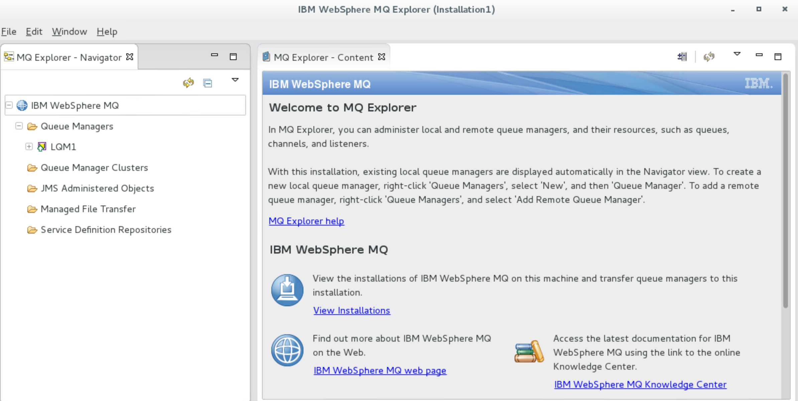
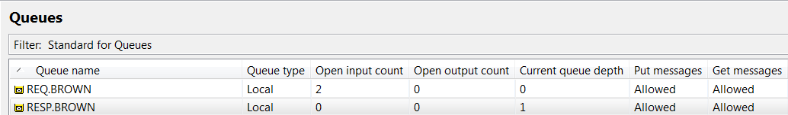
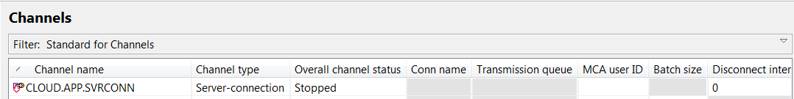
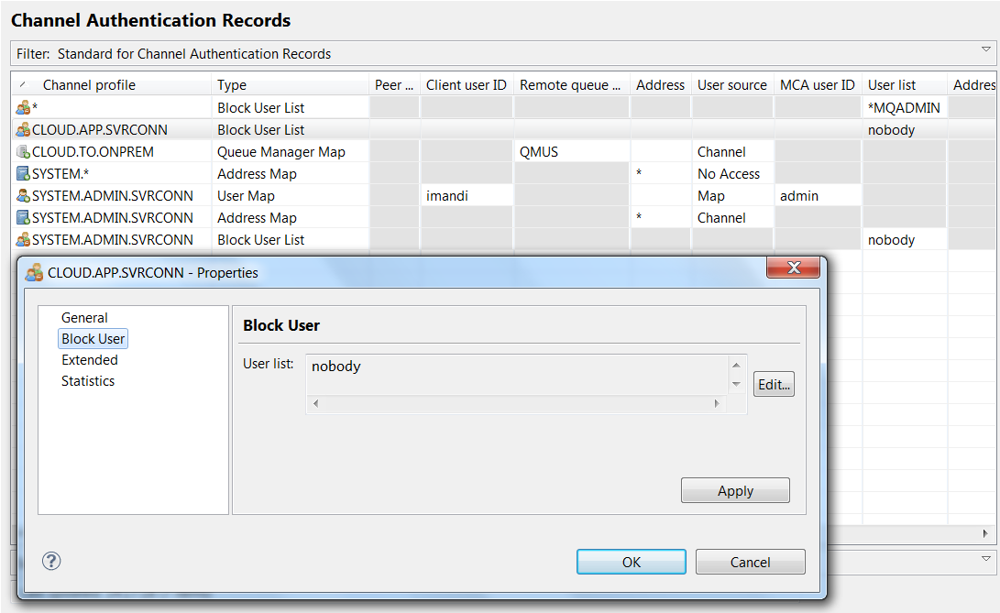
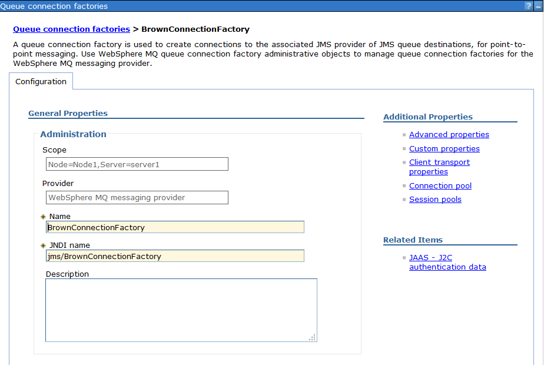
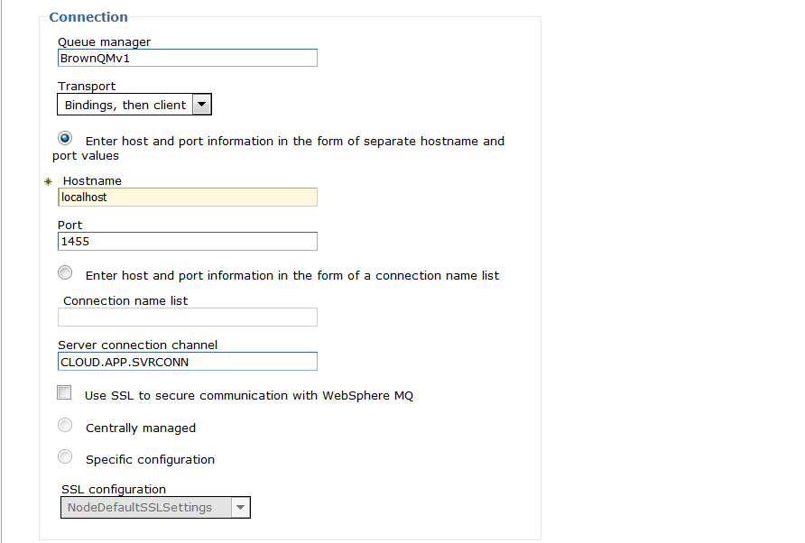
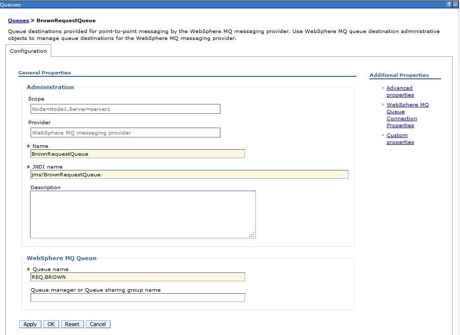
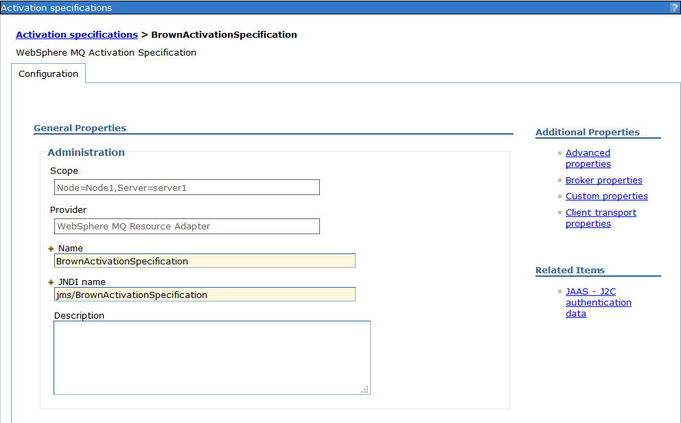
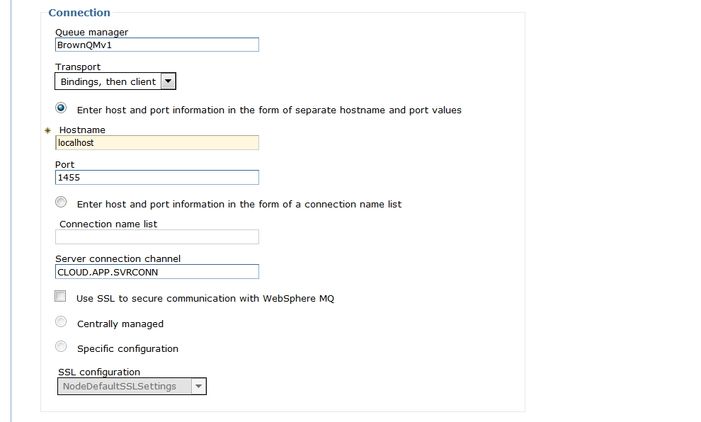
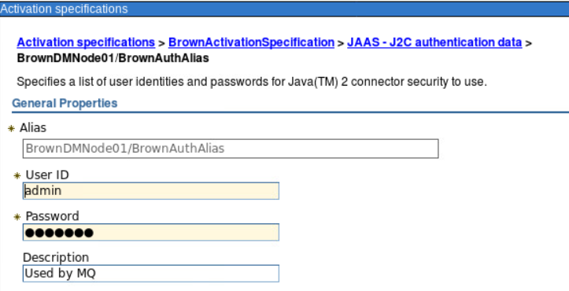

# On premise MQ server (vSphere)

For on-premise server we are using a vSphere environment with at least three hosts, one running DB2 server, one WebSphere Application Server and one IBM MQ.
In this article we are describing how to [configure the MQ Queue manager](1--configuration-queue-manager) using IBM WebSphere MQ Explorer tool and how to [configure WebSphere Application Server resources](#2--configuring-websphere-application-server-to-access-mq) to access MQ queue.

## 1- Configuration Queue manager

Start MQ Explorer from your server installation. We used RedHat RHEL version 7.3, so MQ Explorer is in the Developer folder.



Under the Queue Managers folder look at the standard QM definition: The Queue manager is named LQM1...


### Queues

Under the LQM1 > Queues folder we have defined two queues: REQ.BROWN and RESP.BROWN for the request / response messaging:



Under `Channels`, one server connection channel (CLOUD.APP.SVRCONN) was defined for the MDB to exclusively use to connect to the queue manager.



For the CLOUD.APP.SVRCONN channel, the MCA user ID was set
to `admin`. This means that the MDB application will be connected to the Queue Manager as “admin” which is a user ID defined on the operating system where the Queue Manager is running.


### Channel Authentication Record

One `Channel Authentication Record` was added to the CLOUD.APP.SVRCONN to do not block users.



### Listener

One listener was defined with port 1415 for the MDB application to connect into


### Runmqsc Commands

These commands were issued with the “runmqsc” CLI to allow clients
to connect.

```
SET CHLAUTH(CLOUD.APP.SVRCONN) TYPE(BLOCKUSER) USERLIST('nobody')`

ALTER AUTHINFO(SYSTEM.DEFAULT.AUTHINFO.IDPWOS) AUTHTYPE(IDPWOS) CHCKCLNT(OPTIONAL)

REFRESH SECURITY TYPE(CONNAUTH)
```

## 2- Configuring WebSphere Application Server to access MQ

As the MDB will be deployed as EJB on WebSphere Application Server, we need to do some configuration within WAS using the Admin Console web app:

### Define Queue Connection Factory



The hostname needs to match the MQ VM hostname and the port number the one sets up in previous listener configuration, as well as the server connection channel name:




### Defining Queues

We are defining two queues also in WebSphere. The most important one is the `REQ.BROWN` one as this is the one used to get message from. The `RESP.BROWN` is more for testing.




### Defining activation specification






### Authentication Alias

