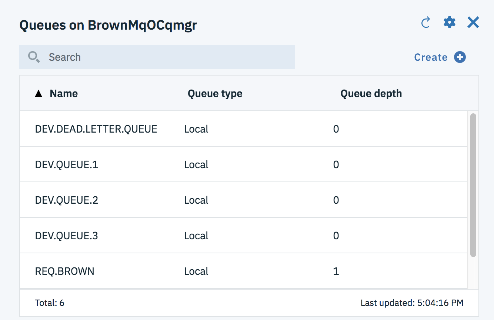
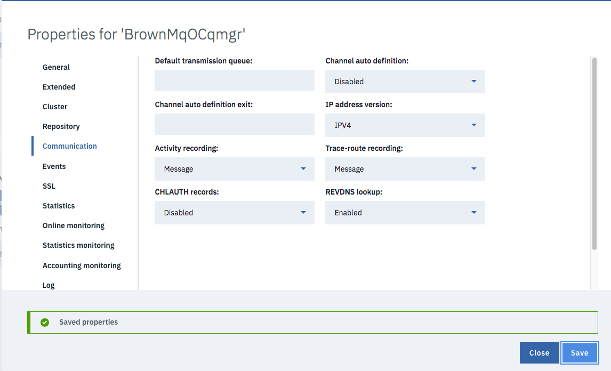

# Inventory message producer

This folder includes different MQ producers for testing MQ messaging solution. We are using two approaches to integrate with MQ: one approach using JMS APIs and one using MQ APIs.
The producer's goal is to create "new item" messages and to send them to MQ queue. This is to simulate a warehouse backend service with mechanical systems that can scan items when reaching a specific part of the warehouse. The event will be processed, down stream, to persist data in an Inventory database.

## JMS Producer

The code is under the src/main/java with the package `ibm.cte.mq.jms`. As any JMS implementation the code needs to do the following:

* Build a JMF Factory using one of the JMS providers available. MQ comes with a JMS provider.
* Create a connection factory and define the connection parameters to connect to the MQ queue manager host.
* Build a [JMS Context](https://docs.oracle.com/javaee/7/api/javax/jms/JMSContext.html) is a new JMS 2.0 API to manage connection and session. 
* Define the JMS resource destination of the message: here we use the MQ Queue,
* Define the text message from a JSON serialized Inventory object
* Use a JMS producer to send the message to the queue
* Close the connection if there is no more message to send

### Build and run

To build the jar for the producer run maven command: `mvn install`. To run use the script runJmsMQProducer.sh.

If you want to define your own inventory object you can copy the json file in the `data` folder:

```json
{"itemId" : 12,
  "quantity": 10,
  "site": "Manif01",
  "supplierId": 5,
  "cost": 12
}
```

For information about the identifier to use in the test see [the Inventory DB2 project](https://github.com/ibm-cloud-architecture/refarch-integration-inventory-db2).

### Test with local MQ

The `runJmsMQProducer.sh` script uses the config.properties loaded in the classpath which uses a localhost deployed MQ queue manager. So it will run with the MQ docker deployment described [in this note.](../docker/README.md).

### Test with MQ on IBM Cloud 

The `src/main/resources/config-ioc.properties` includes parameters to connect to your remote MQ queue manager deployed on IBM Cloud. 

```
mq.platform:IBM MQ on Cloud
mq.queueManagerName:BrownMqOCqmgr
mq.queueName:REQ.BROWN
mq.hostname:qm-<>.qm.us-south.mqcloud.ibm.com
mq.listenerPort:30073
mq.applicationChannelName:SYSTEM.DEF.SVRCONN
mq.adminChannelName:CLOUD.ADMIN.SVRCONN
mq.userid:boyerje
mq.password:Gs...
```

The script `runJmsRemoteMQProducer.sh` uses this file as program argument so the producer can connect to this Queue manager. 

To get your own parameter be sure to get the API key to access the IBM Cloud MQ service. The key can be downloaded as a json file and looks like:

```json
{"name":"MQ user key","mqUsername":"boyerje","description":"Automatically created api key for MQ usage","createdAt":1545085534459,"apiKey":"G..."}
```
For the hostname and other connection attributes use the Connection information downloaded as JSON as described in [this section]().

After running the producer code the MQ console shows the number of message in the queue has increased:



The traces after the producer execution looks like the following:
> #####################################
 Produce item inventory message to MQ 
Platform:ibmmq-on-cloud
Queue Manager:BrownMqOCqmgr
Queue Name:REQ.BROWN
channel:CLOUD.APP.SVRCONN
hostname:brownmqocqmgr-.....us-south.mqcloud.ibm.com
port:31480
userid:boyerje
password:G....
SUCCESS

Now it is possible to run a JMS consumer using the script: `./runJmsRemoteMQConsumer.sh`.

> ########################################
 Consumer for inventory message from MQ 
 Queue: REQ.BROWN
########################################
  Waiting....  
Received message:   
{"itemId":12,"quantity":10,"site":"Manif01","supplierId":5,"cost":12.0}   
Inventory:
item= 12 for quantity= 10 @ Manif01 from 5

## Troubleshouting

### QMGR connection issue

While running the JMS producer the Java code generates an exception with the message:
> com.ibm.msg.client.jms.DetailedJMSSecurityRuntimeException: JMSWMQ2013: The security authentication was not valid that was supplied for QueueManager 'BrownMqOCqmgr' with connection mode 'Client' and host name

You can access the standard logs for the QManager using the IBM Cloud MQ service console, under the `Logs and diagnostics`. Once downloaded we can see the following issue:  


> AMQ9776E: Channel was blocked by userid

EXPLANATION:
The inbound channel 'CLOUD.APP.SVRCONN' was blocked from address '1.....'
because the active values of the channel were mapped to a userid which should
be blocked. The active values of the channel were 'MCAUSER(boyerje)
CLNTUSER(boyerje)'.
ACTION:
Contact the systems administrator, who should examine the channel
authentication records to ensure that the correct settings have been
configured. The ALTER QMGR CHLAUTH switch is used to control whether channel
authentication records are used. The command DISPLAY CHLAUTH can be used to
query the channel authentication records.

So one of the way to quickly fix is to disable  the CHLAUTH in the connection properties of the QManager:


